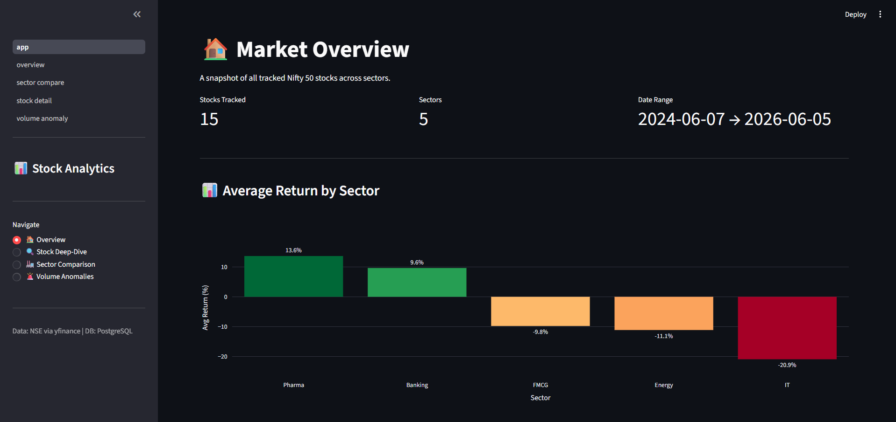
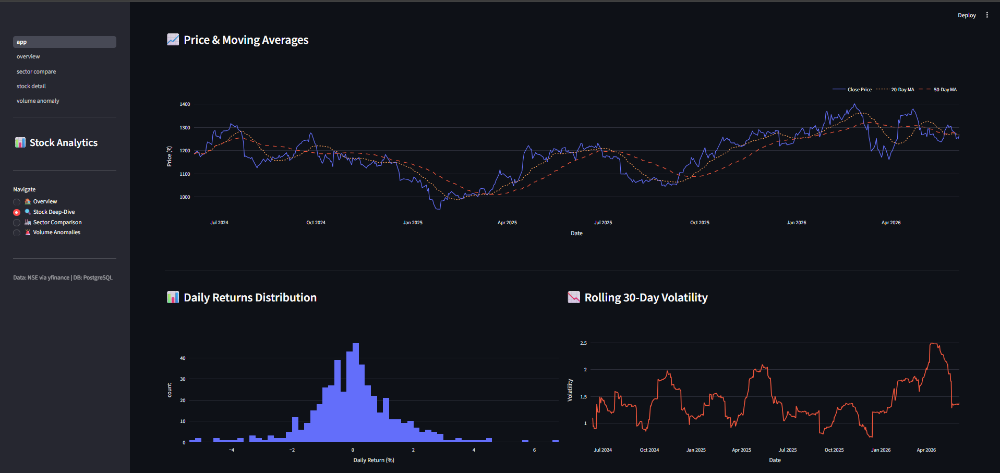
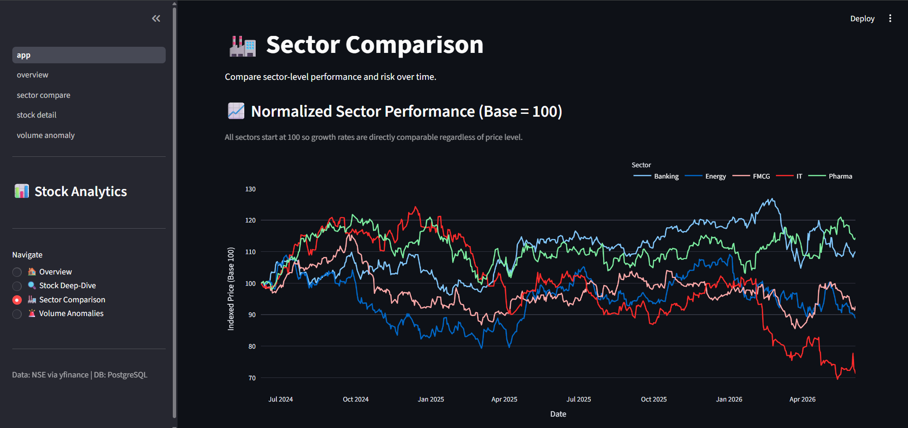
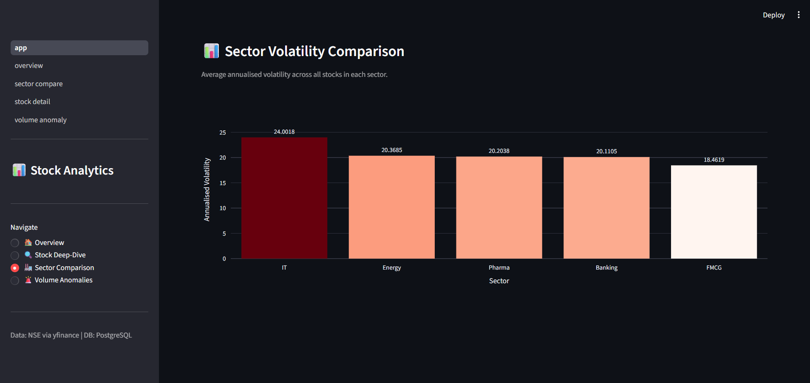
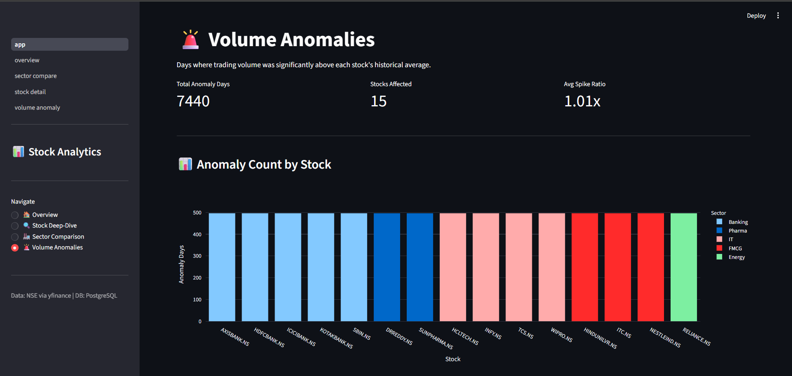
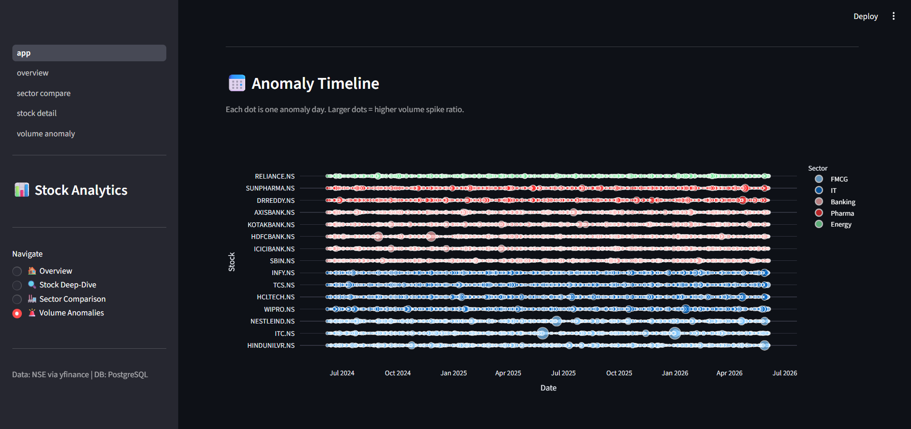
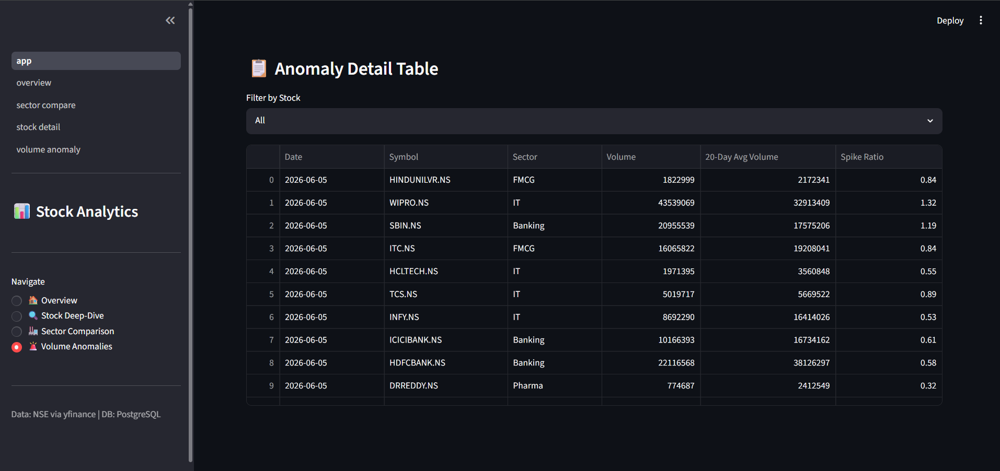

# 📈 Indian Stock Market Analytics Pipeline

An end-to-end data engineering and analytics project tracking **15 Nifty 50 stocks** across **5 sectors**, built with Python, PostgreSQL, and Streamlit.

[](https://python.org)
[](https://postgresql.org)
[](https://streamlit.io)
[](https://plotly.com)

---

## 🗂️ Project Overview

This project demonstrates a complete analytics pipeline — from raw data ingestion to an interactive dashboard — using real NSE market data sourced via `yfinance`.

**Stocks tracked:** 15 Nifty 50 companies across IT, Banking, Energy, FMCG, and Pharma  
**Date range:** June 2024 → June 2026  
**Total records:** ~11,000+ daily price rows

---

## 🏗️ Architecture

```
yfinance API
     │
     ▼
ingestion/ingest.py          ← Fetches OHLCV data, saves to CSV
     │
     ▼
ingestion/load_to_db.py      ← Loads CSV into PostgreSQL (star schema)
     │
     ▼
PostgreSQL (stock_analytics)
  ├── dim_stock               ← Stock dimension table
  ├── dim_sector              ← Sector dimension table
  ├── fact_prices             ← Daily OHLCV prices (fact table)
  └── SQL Views
        ├── vw_daily_returns
        ├── vw_moving_averages
        ├── vw_volatility
        └── vw_volume_anomaly
     │
     ▼
dashboard/app.py             ← Streamlit multi-page dashboard
  ├── Overview
  ├── Stock Deep-Dive
  ├── Sector Comparison
  └── Volume Anomalies
```

---

## ✨ Features

- **Automated ingestion** — pulls 2 years of daily OHLCV data for 15 stocks in one command
- **Star schema database** — dimension and fact tables designed for analytical queries
- **SQL analytical views** — pre-built views for returns, moving averages, volatility, and volume anomalies using window functions
- **Interactive dashboard** — 4-page Streamlit app with Plotly charts
- **Secrets management** — credentials stored in `.env`, never hardcoded

---

## 📊 Dashboard Screenshots

### 🏠 Market Overview


### 📉 Stock Deep-Dive — Price & Moving Averages


### 🏭 Sector Comparison — Normalised Performance


### 📊 Sector Volatility Comparison


### 🚨 Volume Anomalies


### 📅 Anomaly Timeline


### 📋 Anomaly Detail Table


---

## 🗃️ Database Schema

```sql
dim_sector   (sector_id, sector_name)
dim_stock    (stock_id, ticker, company, sector_id)
fact_prices  (price_id, stock_id, date, open, high, low, close, volume)
```

**Analytical Views:**
| View | Description |
|------|-------------|
| `vw_daily_returns` | Daily % return per stock using LAG window function |
| `vw_moving_averages` | 20-day and 50-day moving averages using AVG OVER |
| `vw_volatility` | Rolling 30-day annualised volatility |
| `vw_volume_anomaly` | Flags days where volume exceeds 20-day average |

---

## 🚀 Getting Started

### Prerequisites
- Python 3.10+
- PostgreSQL 14+
- Git

### 1. Clone the repo
```bash
git clone https://github.com/manikantakr/indian-stock-analytics.git
cd indian-stock-analytics
```

### 2. Install dependencies
```bash
pip install -r requirements.txt
```

### 3. Set up environment variables
Copy the example file and fill in your PostgreSQL credentials:
```bash
cp .env.example .env
```

Edit `.env`:
```
DB_HOST=localhost
DB_PORT=5432
DB_NAME=stock_analytics
DB_USER=postgres
DB_PASSWORD=your_password_here
```

### 4. Create the PostgreSQL database
```bash
psql -U postgres -c "CREATE DATABASE stock_analytics;"
```

Then run the schema SQL to create tables and views:
```bash
psql -U postgres -d stock_analytics -f sql/analytical_views.sql
```

### 5. Run the ingestion pipeline
```bash
# Step 1 — Fetch data from yfinance and save to CSV
python ingestion/ingest.py

# Step 2 — Load CSV into PostgreSQL
python ingestion/load_to_db.py
```

### 6. Launch the dashboard
```bash
python -m streamlit run dashboard/app.py
```

Open your browser at `http://localhost:8501`

---

## 📁 Project Structure

```
indian-stock-analytics/
├── ingestion/
│   ├── ingest.py            # Fetches stock data via yfinance
│   └── load_to_db.py        # Loads CSV into PostgreSQL
├── sql/
│   └── analytical_views.sql # Star schema + all analytical views
├── dashboard/
│   ├── app.py               # Streamlit app entry point
│   ├── db.py                # Database connection helper
│   └── pages/
│       ├── overview.py
│       ├── stock_detail.py
│       ├── sector_compare.py
│       └── volume_anomaly.py
├── assets/                  # Dashboard screenshots
├── data/raw/                # Auto-generated CSV (git-ignored)
├── .env.example             # Environment variable template
├── .gitignore
└── requirements.txt
```

---

## 🛠️ Tech Stack

| Layer | Technology |
|-------|-----------|
| Data Ingestion | Python, yfinance, pandas |
| Database | PostgreSQL 17 |
| DB Driver | psycopg2 |
| Analytics | SQL window functions (LAG, AVG OVER, STDDEV OVER) |
| Dashboard | Streamlit, Plotly |
| Secrets | python-dotenv |

---

## 👤 Author

**Manikanta KR**  
[](https://www.linkedin.com/in/manikantakr/)
